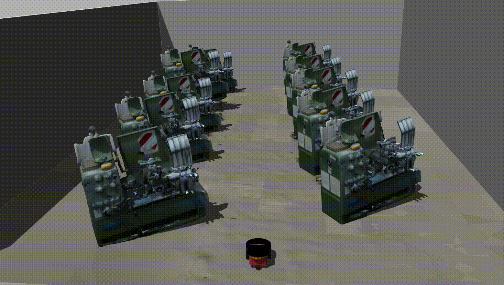

# 3D Scene Reconstruction from Sparse SLAM for Simulation

[](demo/demo1.mp4)  

[](demo/demo2.mp4)

## Project Overview 專案簡介

This project provides an **end-to-end 3D scene reconstruction pipeline** that transforms **sparse SLAM point clouds (R3LIVE outputs)** into **simulation-ready environments**.  
The framework integrates three key modules:  

1. **GPU-accelerated mapping & depth completion**  
   - Real-time fusion of LiDAR + RGB with CUDA acceleration  
   - Semantic-aware depth completion using SAM + Depth Anything  

2. **Scene-adaptive geometry reconstruction**  
   - Indoor: PointNet++ segmentation + Poisson Surface Reconstruction  
   - Outdoor: Cloth Simulation Filtering (CSF) + PoinTr (transformer-based completion)  

3. **Photorealistic texture synthesis**  
   - Outdoor background: **Paint3D** diffusion-based texture generation  
   - Indoor objects: **Hunyuan3D-2** single-view textured mesh generation  

Final outputs are **meshed, textured, URDF-compatible** models that can be directly deployed in **Gazebo** for robotics, autonomous navigation, and digital twin applications:contentReference[oaicite:2]{index=2}:contentReference[oaicite:3]{index=3}.

本專案提出一個整合 **GPU 加速建圖、幾何補全、與擴散模型紋理生成** 的三維重建系統。輸入為 SLAM 稀疏點雲，輸出為高擬真之紋理化場景，可直接應用於 **Gazebo 模擬器**，支援智慧工廠、自駕車與機器人應用。

---

## Demo

- [Demo 1 (Indoor Scene)](demo/demo1.mp4)  
- [Demo 2 (Outdoor Scene)](demo/demo2.mp4)  

---

## Installation 安裝教學

### 1. Clone repository
```bash
git clone https://github.com/YourUserName/3D-SLAM-Reconstruction.git
cd 3D-SLAM-Reconstruction
```

### 2. Create conda environment
```bash
conda create --name slam3d python=3.8
conda activate slam3d
```

### 3. Install dependencies
Make sure you are using Ubuntu 20.04 with ROS Noetic and have a GPU ≥ RTX 3090Ti.
```bash
# Essential build tools and libraries
sudo apt update && sudo apt install -y \
    python3-pip python3-venv build-essential cmake git \
    libgl1-mesa-glx libglib2.0-0 libopencv-dev

# ROS Noetic and ROS bag support
sudo apt install -y ros-noetic-desktop-full ros-noetic-rosbag ros-noetic-pcl-ros
```

### 4. Install Python dependencies
```bash
pip install -r requirements.txt
```
requirements.txt typically includes:
```bash
torch>=2.0.0
torchvision>=0.15.0
open3d>=0.17.0
numpy
scipy
matplotlib
transformers>=4.31.0
diffusers>=0.22.0
```

### 5. Prepare required models and directories
Make sure you have downloaded the pretrained models for PointNet++, PoinTr, Paint3D, and Hunyuan3D-2.
Place them in the following directory structure:
```bash
3D-SLAM-Reconstruction/
├── cloudcompare/          # Optional visualization tool configs
├── demo/                  # Demo videos (.mp4)
├── Gazebo_Scenes/         # Ready-to-use simulation environments
├── GitHub/                # Core reconstruction scripts and configs
├── Hunyuan3D-2/           # Hunyuan3D-2 model and configs
├── Paint3D/               # Paint3D texture synthesis model
├── pointnet.pytorch/      # PointNet++ semantic segmentation model
├── PoinTr/                # Transformer-based point cloud completion model
├── r3liveGPU_output/      # Default output directory for reconstructed results
└── READMD.md
```

## Usage / Experiment 實驗執行
### 1. Prepare input data

* Record SLAM data using R3LIVE with LiDAR + RGB + IMU.
* Place your `.bag` file into a `data/` folder, for example:
  ```bash
  mkdir data
  mv my_scene.bag data/
  ```

### 2. Configure paths and parameters
Open `config.yaml` (or modify variables inside `demo_run.sh`) and set:
| Parameter            | Description                           | Default path         |
| -------------------- | ------------------------------------- | -------------------- |
| `BAG_PATH`           | Input ROS bag file                    | `./data/demo.bag`    |
| `OUTPUT_DIR`         | Reconstruction results                | `./r3liveGPU_output` |
| `PAINT3D_DIR`        | Paint3D model directory               | `./Paint3D`          |
| `POINTR_DIR`         | PoinTr model directory                | `./PoinTr`           |
| `SEGMENTATION_MODEL` | PointNet++ segmentation model         | `./pointnet.pytorch` |
| `HUNYUAN3D_DIR`      | Hunyuan3D-2 model directory           | `./Hunyuan3D-2`      |
| `USE_POISSON`        | Use Poisson for mesh reconstruction   | `true`               |
| `IS_POINTR`          | Enable PoinTr object-level completion | `true`               |

### 3. Run the full pipeline demo
Use the provided demo script for a one-command workflow:
```bash
cd GitHub
./demo_run.sh
```

This will automatically execute three main steps:

**Step 01 — GPU-Accelerated Mapping**

* Performs semantic depth completion
* Uses CUDA-based fusion of LiDAR + RGB + IMU
* Produces dense, semantically enriched point clouds

**Step 02 — Geometry Reconstruction**

* Indoor: PointNet++ segmentation + Poisson Surface Reconstruction
* Outdoor: Cloth Simulation Filtering (CSF) + PoinTr for object-level completion
* Converts dense point clouds into watertight meshes

**Step 03 — Diffusion-Based Texture Synthesis**

* Outdoor background: Paint3D generates photorealistic textures
* Indoor objects: Hunyuan3D-2 reconstructs single-view textured meshes
* Outputs textured .obj files compatible with Gazebo

### 3. Output structure
After running the pipeline, the reconstructed OBJ results are stored in `OUTPUT_DIR`.

## Gazebo Integration 模擬器整合
After the reconstruction pipeline finishes, you can deploy the textured scene into Gazebo and control a robot via your existing ROS launch file.

### 1. Export URDF-ready scenes
Once the pipeline finishes, the reconstructed assets are stored in `OUTPUT_DIR`.

### 2. Choose the appropriate launch file
The repository already includes ready-to-use launch files:
| Launch file                      | Environment | Description                                                     |
| -------------------------------- | ----------- | --------------------------------------------------------------- |
| `pioneer_autorun_indoor.launch`  | Indoor      | Loads indoor reconstructed scene and starts robot control node  |
| `pioneer_autorun_outdoor.launch` | Outdoor     | Loads outdoor reconstructed scene and starts robot control node |

### 3. Build the ROS package
Before launching, make sure to rebuild the ROS package:
```bash
cd ~/catkin_ws
catkin build gazebo_control -DPYTHON_EXECUTABLE=/usr/bin/python3
source devel/setup.bash
```

### 4. Launch Gazebo with reconstructed scene
**roslaunch gazebo_control pioneer_autorun_indoor.launch**
```bash
roslaunch gazebo_control pioneer_autorun_indoor.launch
```
**Outdoor reconstructed scene**
```bash
roslaunch gazebo_control pioneer_autorun_outdoor.launch
```

These launch files will:

* Load your reconstructed URDF mworld (/home/user/Gazebo_Scenes/overview_demo_flatten.world).
* Start Gazebo with the appropriate world (indoor/outdoor).
* Spawn your robot model.
* Automatically run the Python control node (scripts/pioneer_mover_v1.0.py) to control the robot’s movement.

### 5. Launch commands
```bash
# Indoor
roslaunch gazebo_control pioneer_autorun_indoor.launch

# Outdoor (if you have an outdoor launch/world)
roslaunch gazebo_control pioneer_autorun_outdoor.launch
```

## Citation
If you use this project or find it helpful in your research, please consider citing the following references:
```bibtex
@inproceedings{lin2022r3live,
  title     = {R3LIVE: A robust, real-time, RGB-colored, LiDAR-inertial-visual tightly coupled state estimation and mapping package},
  author    = {Lin, J. and Zhang, F.},
  booktitle = {Proceedings of the IEEE International Conference on Robotics and Automation (ICRA)},
  pages     = {1060--1067},
  year      = {2022}
}

@inproceedings{yu2021pointr,
  title     = {PoinTr: Diverse point cloud completion with geometry-aware transformers},
  author    = {Yu, X. and Tang, J. and Rao, Y. and Wang, Z. and Huang, T.S. and Liang, J.},
  booktitle = {Proceedings of the IEEE/CVF International Conference on Computer Vision (ICCV)},
  pages     = {12498--12507},
  year      = {2021}
}

@inproceedings{zeng2024paint3d,
  title     = {Paint3D: Paint anything 3D with lighting-less texture diffusion models},
  author    = {Zeng, X. and Xu, X. and Li, Y. and Zhang, Y. and Wang, Y.},
  booktitle = {Proceedings of the IEEE/CVF Conference on Computer Vision and Pattern Recognition (CVPR)},
  pages     = {6543--6552},
  year      = {2024}
}

@article{zhao2025hunyuan3d2,
  title     = {Hunyuan3D-2: Scaling diffusion models for high-resolution textured 3D assets generation},
  author    = {Zhao, Z. and Yang, X. and Xu, Y. and Wang, H.},
  journal   = {arXiv preprint arXiv:2501.12202},
  year      = {2025}
}

@article{mildenhall2020nerf,
  title     = {NeRF: Representing scenes as neural radiance fields for view synthesis},
  author    = {Mildenhall, B. and Srinivasan, P.P. and Tancik, M. and Barron, J.T. and Ramamoorthi, R. and Ng, R.},
  journal   = {Communications of the ACM},
  volume    = {65},
  number    = {1},
  pages     = {99--106},
  year      = {2020}
}
```